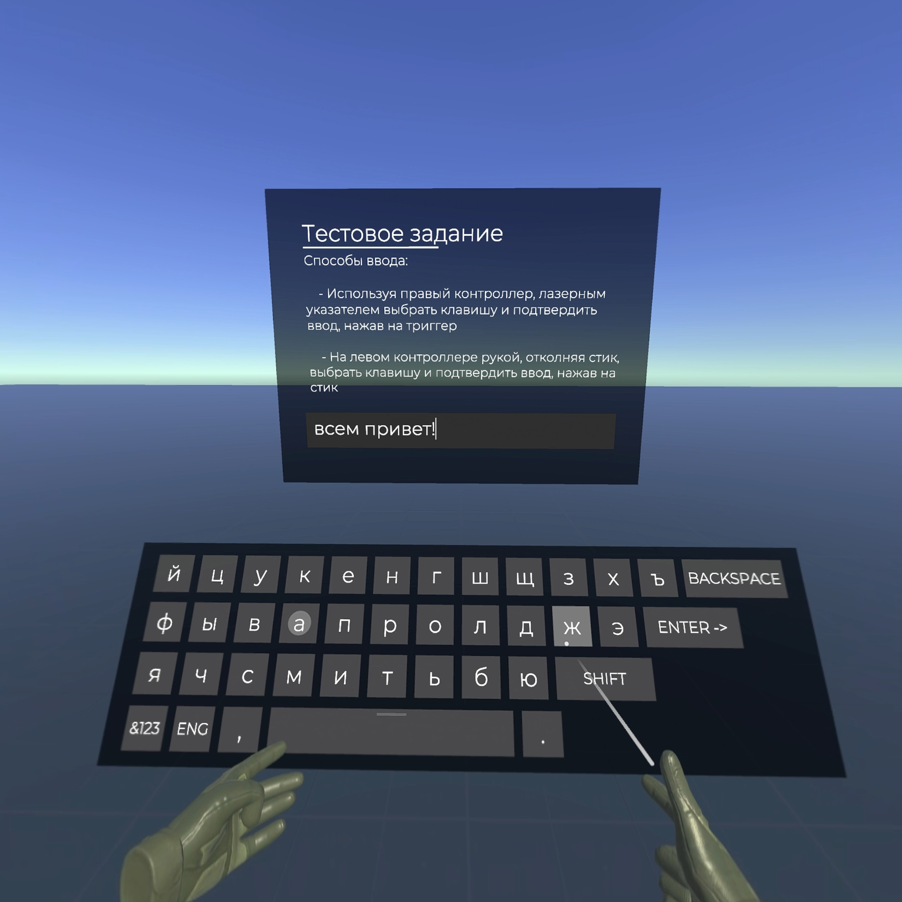

# VR Keyboard Test Task

## Описание

Этот проект тестовое задание по созданию VR-приложения с виртуальной клавиатурой для ввода текста с использованием Unity (версия 2022.3.4f1) и плагина **VRIF 1.82+**. Проект включает два способа ввода текста: использование луча из руки для нажатия клавиш и управление с джойстика контроллера для навигации по клавишам и подтверждения ввода.

Цель проекта — продемонстрировать базовые навыки работы с VR и C# в Unity.

## Требования

- **Unity 2022.3.4f1**.
- **VRIF 1.82+** (плагин для работы с VR в Unity).
- **OpenXR** для кроссплатформенной поддержки (Oculus Quest 2 и SteamVR).
- **Платформы**: Oculus Quest 2, SteamVR (PC).

## Функциональные требования

1. **VR-клавиатура**:
    - Реализована клавиатура для ввода текста в виртуальной реальности.
    - Два способа ввода:
        - **Классический**: использование луча, кастуемого из руки для нажатия клавиш.
        - **Управление с джойстика**: навигация по клавишам с помощью джойстика и подтверждение ввода кнопкой.

2. **Поддержка платформ**:
    - Работает на **SteamVR** (PC) и **Oculus Quest 2**.
    - Обеспечена стабильная работа приложения с частотой кадров 72+ FPS.

## Настройка проекта

### 1. Установка Unity

- Установите **Unity 2022.3.4f1** через **Unity Hub**.
- Убедитесь, что установлены компоненты для **Android Build Support** и **OpenJDK**.

### 2. Установка Oculus Integration и OpenXR

1. Перейдите в **Window > Package Manager**.
2. Установите **Oculus XR Plugin** и **OpenXR Plugin**.
3. В настройках **Player Settings** убедитесь, что выбрана платформа **Android**, и настроены параметры для Oculus.

### 3. Настройка XR

1. Откройте **Edit > Project Settings > XR Settings**.
2. Включите **Virtual Reality Supported** и добавьте **Oculus** в список SDKs.
3. Включите **OpenXR** для кроссплатформенной работы.

### 4. Настройка для Oculus Quest 2

- Включите **Developer Mode** на Oculus Quest 2.
- Подключите Oculus Quest 2 к ПК через USB и используйте **ADB** для установки APK.
- Убедитесь, что проект настроен на сборку для **ARM64** и использует **IL2CPP** в качестве скриптового движка.

## Сборка и запуск

### 1. Для сборки проекта под Android:

1. Перейдите в **File > Build Settings**.
2. Выберите **Android** в качестве платформы и нажмите **Switch Platform**.
3. Нажмите **Build And Run**, чтобы собрать и установить приложение на Oculus Quest 2.

### 2. Для сборки проекта под SteamVR:

1. Перейдите в **Edit > Project Settings > Player** и выберите **PC, Mac & Linux Standalone** как платформу.
2. В **XR Settings** выберите **OpenVR** в качестве SDK.
3. Соберите приложение и запустите его через SteamVR.

## Тестирование

1. Приложение можно протестировать с использованием контроллеров Oculus Quest 2 или контроллеров SteamVR.
2. Проверьте работу ввода текста на VR-клавиатуре:
   - Используйте луч для нажатия клавиш.
   - Используйте джойстик для навигации по клавишам и подтверждения ввода.

## Структура проекта

- **Scripts**: Содержит C# скрипты для работы с клавиатурой;
- **Scenes**: Содержит сцену для демонстрации работы клавиатуры.